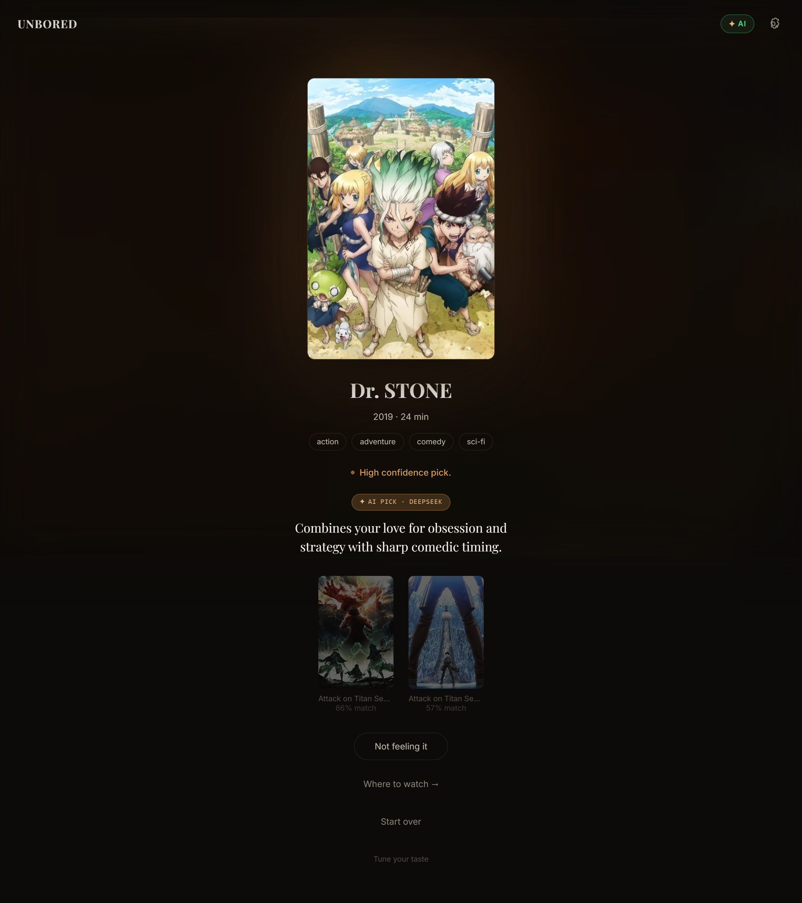

# Unbored

**Tell us a few things you love. Get one perfect pick — chosen and explained by AI.**
No infinite scroll, no twenty-minute "what should we watch" negotiation.


### ▶ [Live demo → unbored-five.vercel.app](https://unbored-five.vercel.app)

The free-tier backend may take ~50s to wake on the first visit. Bring a free
Gemini or DeepSeek key in the app for the full AI experience.


---

## Why this exists

Unbored is one of a six-project portfolio built around a single idea: **tools
that turn messy raw signal into legible intelligence, rendered through
hand-built visualization instead of dropped-in libraries.**

The other five are for analysts and developers. This one is for everybody else.
The "messy signal" is a sprawling catalog of movies, shows, and anime; the
"legible intelligence" is *one pick you can trust* — found by a real
content-based engine, then chosen and explained by an LLM that's grounded in the
exact things you said you love.

---

## How it works

**1. Tell it what you love.** A 30-second onboarding: search and pick a few
favourites across movies, TV, and anime.

**2. A real engine narrows the field.** Every title is a BM25-weighted content
vector; your taste is the centroid of (and nearest neighbours among) the things
you picked. The engine ranks the whole catalog by a hybrid kNN+centroid
similarity, then re-ranks the top matches by your mood and the time you have.
This is genuinely good *on its own* — no LLM required.

**3. AI makes the final call.** Connect your own Gemini or DeepSeek key and the
LLM picks the single best option from the engine's shortlist and explains it in
one sentence, tied to what you love — *"Dr. STONE's clever humor and obsession
with science will make you laugh."*

```text
 You pick favourites ─▶ Content engine ─▶ shortlist ─▶ Your LLM ─▶ one pick
 (movies/TV/anime)      BM25 · kNN+centroid           (Gemini /    + a reason
                        tone · runtime · MMR           DeepSeek)    in your words
```

---

## The engine (no LLM needed)

The deterministic engine is the centrepiece, and it's pure-Python with **no ML
dependencies**:

- **BM25-weighted content vectors** over title, genres, keywords, overview, and
  people — cosine similarity in a real vector space, not exact string matching.
- **Hybrid kNN + centroid relevance** with a similarity-weighted neighbour mean,
  so loving *both* horror and rom-coms doesn't average into mush.
- **Tone model** — five interpretable axes (energy, darkness, warmth, intensity,
  humor) give a smooth "mood fit" instead of crude genre on/off toggles.
- **Retrieve-then-rerank** — narrow to your strongest taste matches, then let
  mood and runtime choose within them, so the mood you pick actually changes the
  result.
- **Bayesian quality prior**, **smooth runtime fit**, **MMR-diversified
  alternates**, and **distribution-calibrated confidence**.

---

## Bring your own AI (Gemini or DeepSeek)

The LLM layer is **bring-your-own-key**, and token-frugal by design — one ~90-token
call sends your liked titles, mood, and the shortlist (titles only) and gets back
the pick plus a one-line reason.

| Provider | Get a key | Notes |
| --- | --- | --- |
| Google **Gemini** | [aistudio.google.com](https://aistudio.google.com/app/apikey) | Free tier, ~30s to set up |
| **DeepSeek** | [platform.deepseek.com](https://platform.deepseek.com/api_keys) | Low-cost, OpenAI-compatible |

Your key lives **in your browser**, is sent per request over HTTPS, and is
**never logged or stored** on the server. Without a key you still get strong
picks from the engine.

<p align="center">
  
  
</p>

---

## Run it locally

One command sets everything up and starts both servers:

```bash
python run.py
```

(Or double-click `start.bat` on Windows / `./start.sh` on macOS/Linux.)
Prerequisites: **Python 3.11+** and **Node.js 18+**. No API keys needed to
start — connect a Gemini/DeepSeek key in the app for AI picks.

The app ships with a **self-owned catalog** (`backend/app/data/catalog.json`,
~835 titles built from TMDB + AniList), so there are **no live TMDB/AniList
calls at request time** — it's fast and never blocked on a flaky upstream API.

---

## Architecture

```text
 React + Vite (TS)                 FastAPI (Python)
 ┌──────────────────┐   /api   ┌──────────────────────────────┐
 │  Onboarding       │ ───────▶ │  Catalog (catalog.json)      │
 │  Mood / Time /    │          │  Content engine              │
 │   media-type      │          │   BM25 · kNN+centroid ·      │
 │  Cinematic reveal │ ◀─────── │   tone · runtime · MMR       │
 │  BYO-key (browser)│  pick    │  LLM curator (per-request    │
 └──────────────────┘          │   user key: Gemini/DeepSeek) │
                               └──────────────────────────────┘
```

Data is owned, not fetched live: `scripts/build_catalog.py` builds the catalog
once, offline, from TMDB + AniList (with attribution).

---

## Project layout

```text
unbored/
├── run.py                     # one-command launcher
├── backend/
│   ├── scripts/build_catalog.py  # offline catalog builder
│   └── app/
│       ├── engine/            # content.py (BM25), tone.py, engine.py
│       ├── llm/               # providers + per-request cache (BYO key)
│       ├── services/          # catalog, curator, taste builder, rationale
│       ├── routers/           # recommend, search, taste, llm, health
│       └── data/              # catalog.json, tone lexicon, mood targets
└── frontend/
    └── src/
        ├── components/llm/    # ConnectAI, AIStatusBanner
        ├── pages/             # onboarding (3-step), home, settings
        └── stores/            # taste, recommendation, llm (key), ui
```

---

## Development

```bash
# Backend (from backend/)
python -m uvicorn app.main:app --reload --port 8000
python -m pytest                    # 187 tests

# Frontend (from frontend/)
npm run dev                         # http://localhost:5173
npm run build

# Rebuild the catalog (needs a TMDB key in backend/.env)
python scripts/build_catalog.py
```

API docs at `http://localhost:8000/docs`.

---

## Tech stack

**Frontend** — React 19, Vite, TypeScript, Zustand, Framer Motion, CSS Modules.
No UI kit, no chart library; the visual identity is hand-built.
**Backend** — Python, FastAPI, Pydantic v2, httpx. The recommender is pure
Python (no numpy/sklearn).
**Data** — a self-owned catalog from TMDB (movies/TV) + AniList (anime).
**AI** — bring-your-own Gemini or DeepSeek key.

---

## License

MIT — see [LICENSE](LICENSE). Built by Shreyas Fegade. Catalog data from TMDB
and AniList.
