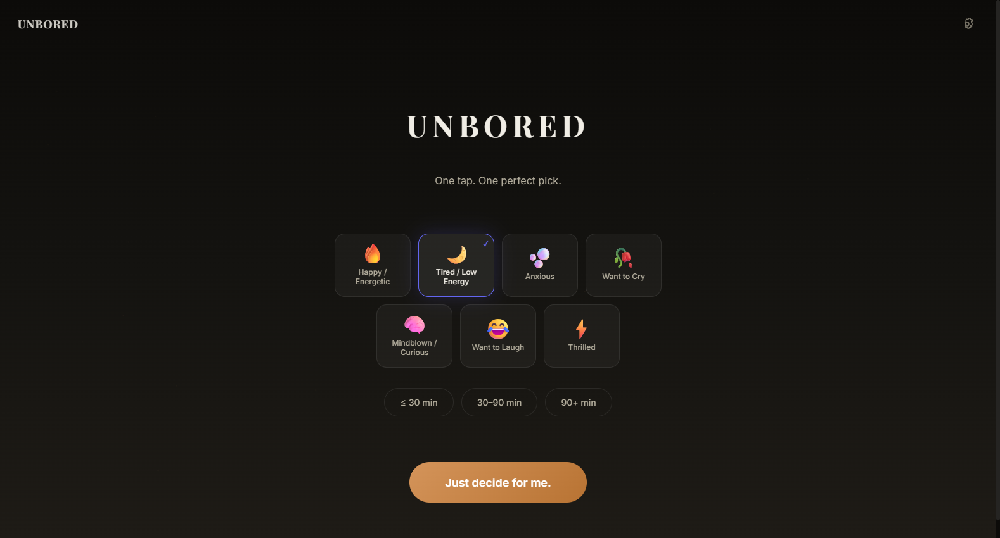
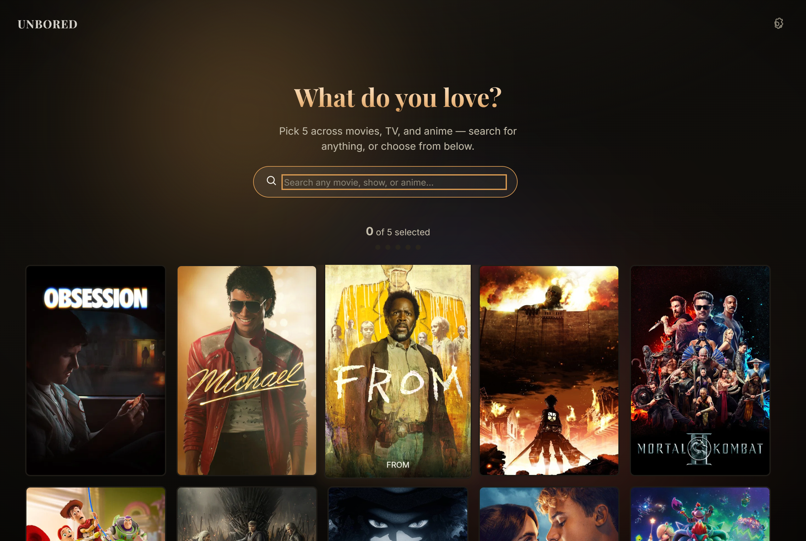
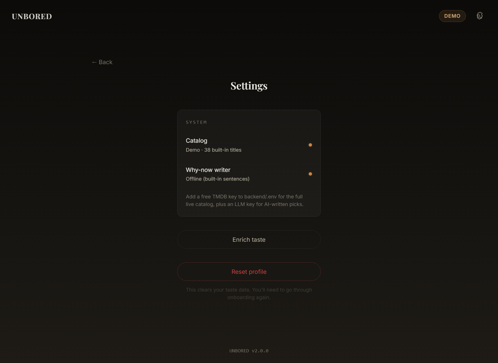

# Unbored

**The decision-paralysis killer.** Pick your mood, tap one button, get one
confident thing to watch — right now. No infinite scroll, no twenty-minute
"what should we watch" negotiation.


### ▶ [Live demo → unbored-five.vercel.app](https://unbored-five.vercel.app)

Runs in zero-key demo mode (38 curated titles). The free-tier backend may take ~50s to wake on the first visit.



---

## Why this exists

Unbored is one of a six-project portfolio built around a single idea: **tools
that turn messy raw signal into legible intelligence, rendered through
hand-built visualization instead of dropped-in chart libraries.**

The other five are for analysts and developers. This one is for everybody else.
The "messy signal" is a sprawling, undifferentiated catalog of movies, shows,
and anime; the "legible intelligence" is *one pick you can trust*, scored across
mood, taste, runtime, and diversity, and explained in a single honest sentence.
The custom visualization is everywhere a generic app would have reached for a
component library: the cinematic reveal, the confidence calibration, and the
procedural poster art generated in the browser for titles with no artwork.

---

## Runs in one command

No keys. No config files to hand-edit. No two-terminal dance.

```bash
python run.py
```

That single command creates the backend virtualenv, installs both halves,
writes a default `.env`, starts the API and the web app together, and opens your
browser. (Prefer a double-click? `start.bat` on Windows, `./start.sh` on
macOS/Linux.)

The only prerequisites are **Python 3.11+** and **Node.js 18+**.

### Zero-key demo mode

Out of the box, with no API keys at all, Unbored runs in **demo mode**: a
hand-curated catalog of 38 acclaimed films, shows, and anime, with built-in
"Why now?" sentences. The entire experience — onboarding, scoring, the reveal —
works offline and instantly, so a first run is never gated on signing up for
anything.

When you're ready for the real thing, drop keys into `backend/.env` and restart.
A **TMDB** key unlocks the live catalog (thousands of titles, fresh trending);
an **LLM** key upgrades the "Why now?" line from built-in sentences to
context-aware generation. Settings shows you exactly what's active.

<p align="center">
  
  
</p>

---

## Bring your own LLM

The "Why now?" sentence is the perceived intelligence of the product, and it's
**provider-agnostic**. Unbored ships with a small provider abstraction, so you
can use whichever model you already pay for — or none:

| Provider     | Env var              | Notes                                          |
| ------------ | -------------------- | ---------------------------------------------- |
| Google Gemini| `GEMINI_API_KEY`     | Generous free tier                             |
| DeepSeek     | `DEEPSEEK_API_KEY`   | OpenAI-compatible, low cost                    |
| OpenAI       | `OPENAI_API_KEY`     | Any `gpt-*` model                              |
| OpenRouter   | `OPENROUTER_API_KEY` | One key, hundreds of models                    |
| _(anything OpenAI-compatible)_ | `OPENAI_BASE_URL` | Point at Groq, Together, Ollama, LM Studio… |

Set `LLM_PROVIDER=auto` (the default) and Unbored uses the first provider you've
given a key to. Set it explicitly (`gemini`, `deepseek`, `openai`, `openrouter`)
to force one, or `none` to always use the offline sentences. Every key is
optional; nothing is required to boot.

DeepSeek, OpenAI, OpenRouter, and local servers all speak the same
`/chat/completions` contract, so they share a single implementation — adding a
new OpenAI-compatible backend is a one-line config change.

---

## Features

- **One-tap recommendation** — mood + time available → one confident pick.
- **Cross-medium taste profile** — built from five favourites you choose across
  movies, shows, and anime.
- **Multi-factor scoring** — genre, keyword, mood, runtime, rating, and a
  diversity penalty, each weighted and transparent.
- **Mood-aware engine** — each mood applies concrete boosts and penalties
  (e.g. *anxious* lifts feel-good and comedy, dampens horror and thriller),
  defined in a config table, not hardcoded.
- **"Why now?" intelligence** — one observational sentence about *the content
  and the moment*, never about your psychology (a strict guardrail, below).
- **Cinematic reveal** — a scanning animation builds anticipation, then the pick
  resolves with confidence calibration and two alternates you can swap to.
- **Procedural poster art** — every artless title gets a deterministic,
  on-brand poster generated in the browser; nothing ever renders broken.
- **"Not feeling it"** — regenerate instantly for a fresh pick.

---

## How it works

```text
 React + Vite (TS)                    FastAPI (Python)
 ┌───────────────────┐    /api    ┌──────────────────────────────┐
 │  Mood + Time       │ ─────────▶ │  Candidate pool              │
 │  Taste onboarding  │           │   • TMDB (movies/shows)       │
 │  Cinematic reveal  │ ◀───────── │   • AniList (anime)           │
 │  Procedural art    │  one pick │   • Offline catalog (demo)    │
 └───────────────────┘           │                              │
                                  │  Weighted scoring engine     │
                                  │   genre · keyword · mood ·   │
                                  │   runtime · rating · diversity│
                                  │                              │
                                  │  "Why now?"  →  LLM provider │
                                  │   (Gemini / DeepSeek / …)    │
                                  └──────────────────────────────┘
```

**The pipeline, end to end:**

1. You pick five favourites; the backend builds a `UserTasteVector` (genre and
   keyword weights, pacing, darkness, humor, animation affinity).
2. A candidate pool is assembled from TMDB + AniList (or the bundled catalog in
   demo mode) and refreshed on a schedule.
3. On each request, candidates are filtered by runtime fit and a quality floor,
   then scored: `genre 25% · keyword 30% · mood 20% · runtime 15% · rating 5%`,
   minus a diversity penalty that discourages repeats.
4. The top pick's confidence is calibrated from its composite score; two
   alternates trail behind.
5. The active LLM writes the "Why now?" sentence; if it's unavailable, rate
   limited, or off, a deterministic fallback steps in seamlessly.

### The "Why now?" guardrail

The sentence may only reference **content qualities and context** — genre,
pacing, tone, runtime fit, time of day, taste overlap. It may **never**
reference your emotional state. A forbidden-pattern filter rejects any output
that drifts into "you seem lonely tonight" territory and substitutes a safe
fallback. The model describes *why the film fits the moment*, not *what's wrong
with you*.

---

## Configuration

Everything lives in `backend/.env` (created for you on first run). Every value
is optional.

| Variable            | Default                  | Purpose                                  |
| ------------------- | ------------------------ | ---------------------------------------- |
| `TMDB_API_KEY`      | _(empty → demo)_         | Live movie/show catalog                  |
| `LLM_PROVIDER`      | `auto`                   | `auto` / `gemini` / `deepseek` / `openai` / `openrouter` / `none` |
| `GEMINI_API_KEY`    | _(empty)_                | Gemini provider                          |
| `DEEPSEEK_API_KEY`  | _(empty)_                | DeepSeek provider                        |
| `OPENAI_API_KEY`    | _(empty)_                | OpenAI provider                          |
| `OPENROUTER_API_KEY`| _(empty)_                | OpenRouter provider                      |

See [`backend/.env.example`](backend/.env.example) for the full annotated list,
including per-provider model and base-URL overrides.

---

## Project layout

```text
unbored/
├── run.py                 # one-command launcher (setup + run both servers)
├── start.bat / .sh / .ps1 # double-click wrappers
├── backend/
│   ├── app/
│   │   ├── llm/            # provider abstraction (Gemini, OpenAI-compatible)
│   │   ├── engine/         # scoring, mood modifiers, diversity, confidence
│   │   ├── services/       # TMDB, AniList, candidate pool, why-now, offline
│   │   ├── routers/        # health/status, taste, recommend, search, media
│   │   ├── models/         # Pydantic schemas
│   │   └── data/           # mood tables, offline catalog, curated overrides
│   └── tests/              # 302 tests
└── frontend/
    └── src/
        ├── components/     # mood, onboarding, poster (incl. PosterArt), reveal
        ├── pages/          # home, onboarding, enrich, settings
        ├── stores/         # Zustand state (taste, recommendation, status, ui)
        └── api/            # typed API clients
```

---

## Development

```bash
# Backend (from backend/)
python -m uvicorn app.main:app --reload --port 8000
python -m pytest                    # 302 tests

# Frontend (from frontend/)
npm run dev                         # http://localhost:5173
npm run build                       # type-check + production build
npm run lint
```

The API serves interactive docs at `http://localhost:8000/docs`, and a live
configuration summary at `http://localhost:8000/api/status`.

---

## Deploy — Vercel (frontend) + Render (backend)

Unbored splits cleanly: the Vite frontend goes to **Vercel**, the FastAPI
backend to **Render**. The frontend calls `/api/*`, which Vercel proxies to the
backend (see [`frontend/vercel.json`](frontend/vercel.json)) — so requests are
same-origin (no CORS) and no backend URL is baked into the bundle.

The live demo runs at **[unbored-five.vercel.app](https://unbored-five.vercel.app)** (frontend) → `unbored-api.onrender.com` (backend). The backend host is interchangeable — the `Procfile` runs equally well on Render, Railway, or Fly.

**1. Backend → Render**

- New → **Blueprint** → pick this repo; Render reads [`render.yaml`](render.yaml)
  (root dir `backend`, build `pip install -r requirements.txt`, start
  `uvicorn app.main:app --host 0.0.0.0 --port $PORT`, health check `/api/health`).
- **Environment variables are all optional** — with none set, the demo catalog
  + offline "Why now?" sentences work out of the box. Add `TMDB_API_KEY` (use the
  TMDB **v4 Read Access Token**) for the live catalog and `GEMINI_API_KEY` (or any
  provider) for AI-written picks. See [`backend/.env.example`](backend/.env.example).
- The free plan spins down after inactivity (first request cold-starts in ~50s).
- Copy the public URL, e.g. `https://unbored-api.onrender.com`.

**2. Frontend → Vercel**

- Edit [`frontend/vercel.json`](frontend/vercel.json) and replace the proxy
  `destination` host with your backend URL. Commit.
- New Vercel project → import this repo → set **Root Directory** to `frontend`.
  Vercel auto-detects Vite (build `npm run build`, output `dist`).
- Deploy. The app loads in demo mode instantly; mood → time → "Just decide for
  me" works with zero keys.

---

## Tech stack

**Frontend** — React 19, Vite, TypeScript, Zustand, Framer Motion, CSS Modules.
No UI kit, no chart library; the visual identity is hand-built.
**Backend** — Python, FastAPI, Uvicorn, Pydantic v2, httpx.
**Data** — TMDB (movies/shows), AniList (anime), pluggable LLMs for reasoning.
**Design** — a dark, cinematic palette with Playfair Display + Inter, glass
surfaces, and deterministic procedural poster art.

---

## Limitations

- Recommendation quality scales with the taste profile — more favourites, better
  picks. The cold-start case is softened with curated fallbacks.
- Unbored tells you *what* to watch, not *where*; the "Where to watch" action
  hands off to a search rather than integrating streaming availability.
- "Why now?" phrasing varies with the chosen model's quality.

---

## License

MIT — see [LICENSE](LICENSE). Built by Shreyas Fegade.
