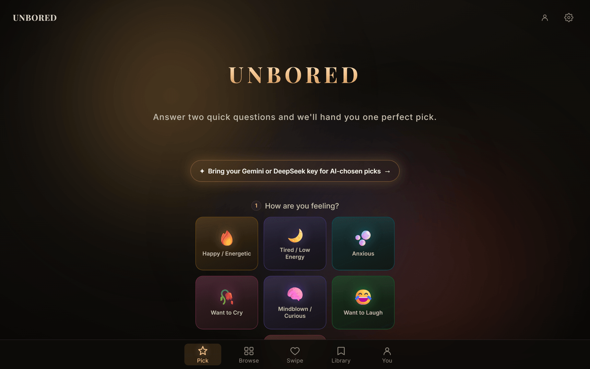
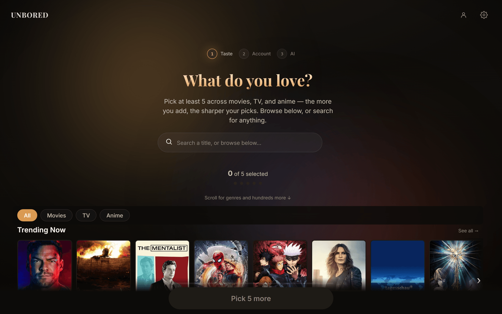
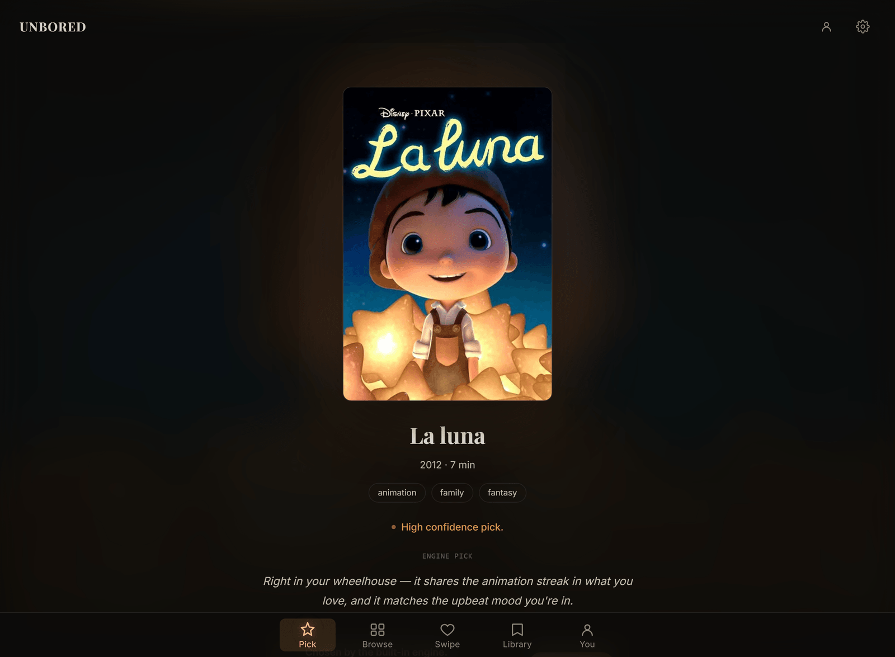
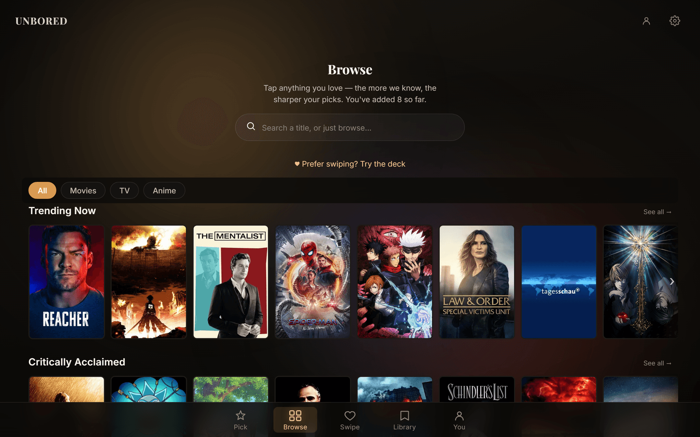
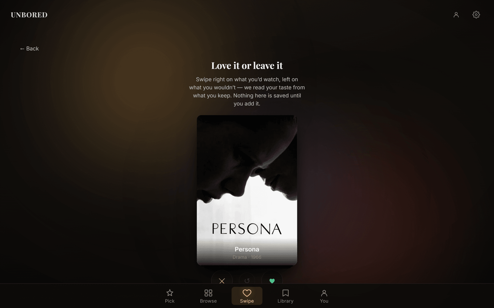
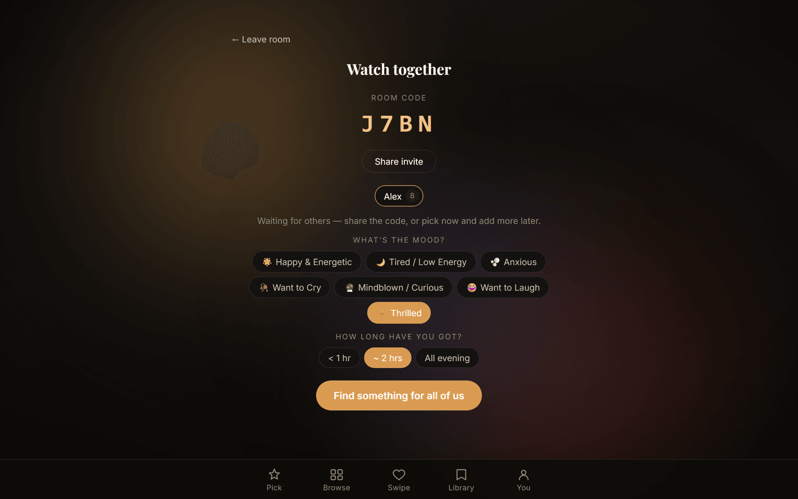
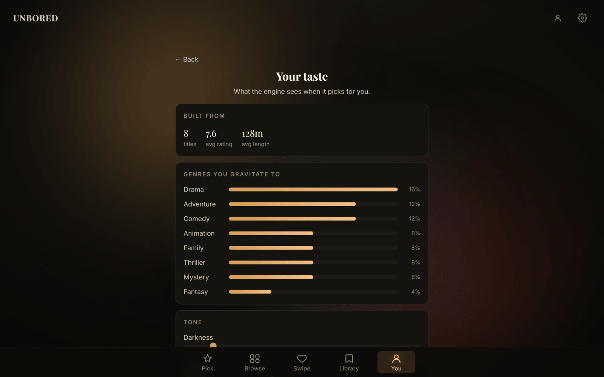

# Unbored

**Tell us a few things you love. Get one perfect pick — chosen and explained by AI.**
No infinite scroll, no twenty-minute "what should we watch" negotiation.


### ▶ [Live demo → unbored-five.vercel.app](https://unbored-five.vercel.app)

The free-tier backend may take ~50s to wake on the first visit. Bring a free Gemini or DeepSeek key
in the app for the full AI experience — everything else works without one.



---

## Why this exists

The problem isn't a shortage of things to watch — it's the opposite. Endless catalogs, endless
scrolling, and a nightly negotiation that ends with the phone back in your pocket. Unbored replaces
all of that with **one pick you can trust**: found by a real content-based engine, then chosen and
explained by an LLM grounded in the exact things you said you love.

---

## How it works

**1. Tell it what you love.** A short, browse-first onboarding — search or scroll and tap a handful
of favourites across movies, TV, and anime.

**2. A real engine narrows the field.** Every title is both a **dense semantic embedding** (it
understands *meaning* — "a film about grief" matches "a story of loss" with zero shared words) **and**
a BM25 sparse vector (it nails exact title / keyword / cast matches). Your taste is the centroid of,
and nearest neighbours among, the things you picked. The engine ranks the whole catalog by this
hybrid similarity, then re-ranks the top matches by your mood and the time you have. It's genuinely
good *on its own* — no LLM required.

**3. AI makes the final call.** Connect your own Gemini or DeepSeek key and the LLM picks the single
best option from the engine's shortlist and explains it in one sentence, tied to what you love.

```text
 You pick favourites ─▶ Content engine ─▶ shortlist ─▶ Your LLM ─▶ one pick
 (movies/TV/anime)      BM25 · kNN+centroid           (Gemini /    + a reason
                        tone · runtime · MMR           DeepSeek)    in your words
```

<p align="center">
  
  
</p>

---

## What's inside

Unbored grew from "one pick" into a small, coherent product. Everything below is built by hand — no
UI kit, no component library, no chart library.

- **Pick** — the core flow: mood + time in, one confident pick out, with a cinematic reveal, alternates,
  and where-to-watch.
- **Browse** — a Netflix-style shelf view of the whole catalog. Genre rows are ranked by how well a
  title *fits* the genre (not by raw popularity), every title appears in exactly one row, and the
  rails scroll with eased, arrow-driven paging.
- **Swipe** — a Tinder-style deck to build taste fast: fling right to keep, left to pass, with
  spring physics, velocity flick, and undo.
- **Watch Together** — start a room, share a four-character code, and everyone joins bringing the
  taste their browser already holds. The group gets **one blended pick** that suits all of them.
- **Fine-tune** — four sliders (familiar ↔ adventurous, crowd-pleasers ↔ hidden gems,
  anything ↔ acclaimed, timeless ↔ fresh) that nudge what a pick optimises for. Zero on every axis is
  an exact no-op, so the defaults are untouched until you move something.
- **Library** — a watchlist, plus *seen* and *not for me* so the engine never suggests the same thing
  twice.
- **Your taste** — a dashboard of what the engine sees: the genres you gravitate to, your tone
  profile, eras, and the names that keep coming up.
- **Accounts (optional)** — sign in and your taste, library and settings sync across devices. Fully
  guest-first: nothing is gated behind an account.
- **Settings** — defaults for a new pick, poster density, reduced-motion, library controls, and JSON
  profile export/import.
- **Installable PWA**, a cohesive motion system, and a dark, hand-built visual identity throughout.

<p align="center">
  
  
</p>
<p align="center">
  
  
</p>

---

## The engine (no LLM needed)

The deterministic engine is the centrepiece. Embeddings are precomputed offline, so the **runtime is
pure-Python with no ML dependencies** — it just loads vectors and does dot products:

- **Hybrid dense + sparse retrieval.** A dense semantic embedding (`bge-small-en-v1.5`, precomputed at
  build time) captures *meaning*; a **BM25-weighted** sparse vector over title, genres, keywords,
  overview, and people captures exact matches. The two are blended, dense-led — the same dense+sparse
  hybrid that powers modern search.
- **Hybrid kNN + centroid relevance** with a similarity-weighted neighbour mean, so loving *both*
  horror and rom-coms doesn't average into mush.
- **Tone model** — five interpretable axes (energy, darkness, warmth, intensity, humor) give a smooth
  "mood fit" instead of crude genre on/off toggles.
- **Retrieve-then-rerank** — narrow to your strongest taste matches, then let mood and runtime choose
  within them, so the mood you pick actually changes the result.
- **Bayesian quality prior**, **smooth runtime fit**, **MMR-diversified alternates**, and
  **distribution-calibrated confidence** — plus the optional per-request tuning weights.

---

## Bring your own AI (Gemini or DeepSeek)

The LLM layer is **bring-your-own-key**, and token-frugal by design — one compact call sends your
liked titles, mood, and the shortlist (titles only) and gets back the pick plus a one-line reason.

| Provider | Get a key | Notes |
| --- | --- | --- |
| Google **Gemini** | [aistudio.google.com](https://aistudio.google.com/app/apikey) | Free tier, ~30s to set up |
| **DeepSeek** | [platform.deepseek.com](https://platform.deepseek.com/api_keys) | Low-cost, OpenAI-compatible |

Your key lives **in your browser**, is sent per request over HTTPS, and is **never logged or stored**
on the server. Without a key you still get strong picks from the engine.

---

## Accounts & sync (optional)

Accounts are a thin, optional layer over [Supabase](https://supabase.com) that leaves the recommendation
API completely stateless. Sync is **local-first**: the browser stores stay the source of truth, and on
sign-in your favourites and library are *merged* (a second device adds to your taste rather than
replacing it) and then kept in sync on a debounce. Sign out and everything stays on the device. If the
project isn't configured, the app simply runs in guest mode — nothing breaks.

---

## Run it locally

One command sets everything up and starts both servers:

```bash
python run.py
```

(Or double-click `start.bat` on Windows / `./start.sh` on macOS/Linux.) Prerequisites: **Python 3.11+**
and **Node.js 18+**. No API keys needed to start — connect a Gemini/DeepSeek key in the app for AI
picks. Accounts are optional; without Supabase env vars the app runs guest-only.

The app ships with a **self-owned catalog** (`backend/app/data/catalog.json`, ~2,400 titles built from
TMDB + AniList), so there are **no live TMDB/AniList calls at request time** — it's fast and never
blocked on a flaky upstream API.

---

## Architecture

```text
 React + Vite (TS)                       FastAPI (Python) · stateless
 ┌───────────────────────────┐   /api   ┌──────────────────────────────┐
 │  Pick · Browse · Swipe     │ ───────▶ │  Catalog (catalog.json)      │
 │  Watch Together · Library  │          │  Content engine              │
 │  Taste · Tuning · Settings │          │   BM25 · kNN+centroid ·      │
 │  Cinematic reveal          │ ◀─────── │   tone · runtime · MMR       │
 │  BYO key (browser)         │  pick    │  LLM curator (per-request    │
 └───────────┬───────────────┘          │   user key: Gemini/DeepSeek) │
             │                          │  Group rooms (in-memory, TTL)│
             ▼                          └──────────────────────────────┘
   Supabase (optional):
   auth + profile sync                  API routes: recommend · search · browse ·
   — the API stays stateless            media · taste · together · llm · health
```

Data is owned, not fetched live: `scripts/build_catalog.py` builds the catalog once, offline, from
TMDB + AniList (with attribution), and `scripts/build_embeddings.py` precomputes the semantic vectors.

**Deployment** — the frontend deploys to **Vercel** (`frontend/vercel.json` proxies `/api` to the
backend, so requests are same-origin), the API to **Render**. Supabase is optional and configured with
two env vars (`VITE_SUPABASE_URL`, `VITE_SUPABASE_PUBLISHABLE_KEY`); the publishable key is safe in the
browser and protected by row-level security.

---

## Project layout

```text
unbored/
├── run.py                        # one-command launcher
├── backend/
│   ├── scripts/build_catalog.py  # offline catalog builder (+ build_embeddings.py)
│   └── app/
│       ├── engine/               # content.py (BM25 + dense), tone.py, engine.py
│       ├── llm/                  # providers + per-request cache (BYO key)
│       ├── services/             # catalog, shelves, curator, rooms, taste, rationale
│       ├── routers/              # recommend, search, browse, media, taste, together, llm, health
│       └── data/                 # catalog.json, embeddings, tone lexicon, mood targets
└── frontend/
    └── src/
        ├── components/           # browse, swipe, reveal, mood, poster, layout, onboarding
        ├── pages/                # onboarding, home, browse, swipe, library, taste, together, account, settings
        ├── stores/               # taste, recommendation, library, preferences, auth, ui (Zustand)
        └── config/motion.ts      # the shared motion vocabulary
```

---

## Development

```bash
# Backend (from backend/)
python -m uvicorn app.main:app --reload --port 8000
python -m pytest                    # 146 tests

# Frontend (from frontend/)
npm run dev                         # http://localhost:5173
npm run lint && npm test && npm run build

# Rebuild the catalog (needs a TMDB key in backend/.env), then its embeddings
python scripts/build_catalog.py
python scripts/build_embeddings.py   # build-time only (pip install fastembed)
```

API docs at `http://localhost:8000/docs`.

---

## Tech stack

**Frontend** — React 19, Vite, TypeScript, Zustand, Framer Motion, CSS Modules, an installable PWA.
No UI kit, no chart library; the visual identity and every animation are hand-built.
**Backend** — Python, FastAPI, Pydantic v2, httpx. The recommender is pure Python (no numpy/sklearn at
request time).
**Data** — a self-owned catalog from TMDB (movies/TV) + AniList (anime).
**AI** — bring-your-own Gemini or DeepSeek key.
**Accounts** — optional Supabase auth + local-first sync.

---

## License

MIT — see [LICENSE](LICENSE). Built by Shreyas Fegade. Catalog data from TMDB and AniList; this product
uses the TMDB API but is not endorsed or certified by TMDB.
